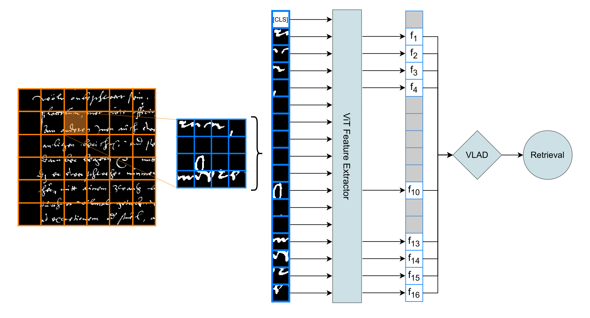

# Self-Supervised Vision Transformers for Writer Retrieval

This repository contains the code implementation of the paper:

**Self-Supervised Vision Transformers for Writer Retrieval**  
Tim Raven, Arthur Matei, Gernot A. Fink  
Published at ICDAR 2024

The method proposed in this paper achieves state-of-the-art performance on the **Historical-WI dataset** and the **HisIR19 dataset** for the task of writer retrieval.

[Read the paper on arXiv](https://arxiv.org/abs/2409.00751)

## Overview

In this work, we present a novel self-supervised learning approach using Vision Transformers for the task of writer retrieval. Our method leverages an attention-based masking strategy (AttMask) to effectively learn representations from handwritten text images without requiring any labeled data. By fine-tuning the self-supervised models, we are able to outperform existing state-of-the-art methods on key writer identification benchmarks.

Key Contributions:
- Self-supervised Vision Transformers tailored for writer retrieval.
- Application of the AttMask technique for efficient representation learning.
- Benchmarking results showing state-of-the-art performance on historical handwriting datasets.

## Training

Our method builds on top of the AttMask framework, with only a few adjustments. The necessary code and modifications are included in the `attmask` folder.

Training scripts can be found in `run.sh`. The script shows how to set up training for writer retrieval using our adjusted implementation.

### Notes:
- We made slight changes to the default values in the AttMask code, particularly related to the location of training data. Ensure you update paths and parameters according to your setup.
- The training data paths and parameters should be updated according to your own dataset location.

## Inference

For inference, we provide an example script located in the root folder as `run.sh`. This script demonstrates how to apply the trained model for writer retrieval on unseen data.

**Important:** This script is different from the training script found in the `attmask` folder.

## Disclaimer

Please note that while the code includes various functionalities, not all of them are required for reproducing our results. These features are part of the broader implementation and may not work out-of-the-box for other use cases. We recommend reviewing and testing them individually based on your specific needs.
